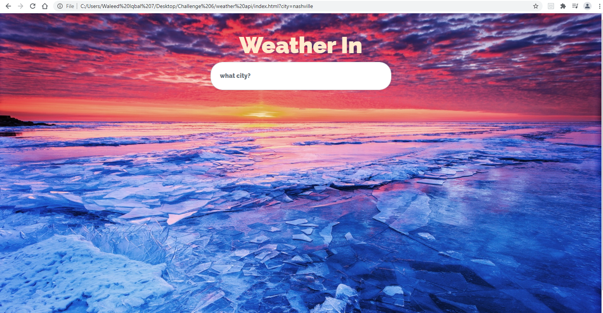

# Open-Weather-Api

You will be introduced to the home screen.
The search bar will be given in which you can type any city of your choice.
the city will be linked to the OpenWeather Api
the information pulled will be the live tempreture in fahrenheit, high, low, humidity, feels like, and live animation of day or night

Source for reference used:
https://youtu.be/QDdn3yrsyCQ
